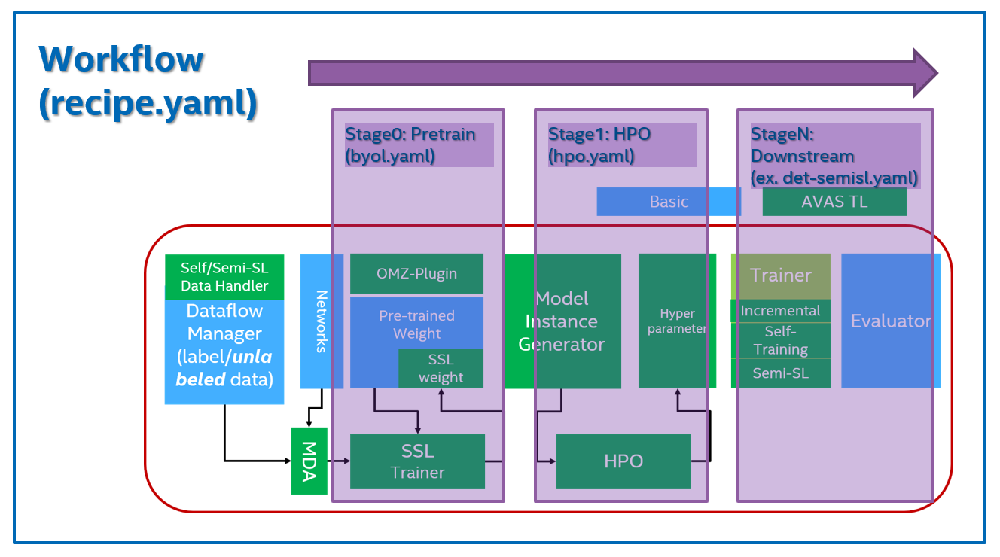

# Model Preparation Algorithm

## Introduction
**Model Preparation** is a stage in DL developer's workflow in which
users could create or re-train models based on given dataset.
This package provides various types of Model Preparation Algorithm (MPA)
as the form of **Transfer Learning Recipe** (TL-Recipe).

### TL-Recipe
Given datasets and base models as inputs, TL-Recipe offers model adaptation
schemes in terms of data domain, model tasks and also NN architectures.

This package consists of
* Custom core modules which implement various TL algorithms
* Training configurations specifying module selection & hyper-parameters
* Tools and APIs to run transfer learning on given datasets & models

### Design Concept
>  **TL ( RECIPE**, MODEL, DATA[, H-PARAMS] ) -> MODEL
* Model: NN arch + params to be transfer-learned
    * Explicitly enabled models only
    * No model input -> train default model from scratch
* Recipe: Custom modules & configs defining transfer learning schemes / modes
    * Defined up to NN arch (e.g. *Incremental learning recipe for FasterRCNN, SSD*, etc)
    * Expose & accept controllable hyper-params w/ default value

### Archtecture
TL-Recipe is based on [pytorch](pytorch.org) as base training framework.
And [MMCV](https://github.com/open-mmlab/mmcv) is adopted as modular configuration framework.
Recipes in this package are implemented using config & module libraries which are also based on MMCV
* [MMClassification](https://github.com/open-mmlab/mmclassification)
* [MMDetection (OTE version)](https://github.com/openvinotoolkit/mmdetection)
* [MMSegmentation (OTE version)](https://github.com/openvinotoolkit/mmsegmentation)

On top of above framework and libraries, we designed **Multi-stage Workflow Framework**
* Workflow: Model training w/ series of sub-stages (RECIPE)
* Stage: Individual (pre)train tasks (SUB-RECIPE)


## Features
TL-Recipe supports various TL *method*s for Computer Vision *task*s and their
related NN *model* architecures.

### TL Tasks
* Classification
* Detection
* Segmentation
    * (WIP) Instance segmentation
    * Semantic segmentation
    * (TBD) Panoptic segmentation
> Train / Infer / Evaluate / Export operations are supported for each task

### TL Methods
Follwing table describes supported TL methods for each tasks.
* Class-Incremental Learning
* Self-Supervised Learning (available soon!)
* Semi-Supervised Learning (available soon!)

### TL Models
TL-Recipe supports transfer learning for subset of
* OTE ([OpenVINO Traning Exetension](https://github.com/openvinotoolkit/training_extensions)) models
* Some custom pytorch models

For detailed list, please refer to: [OTE Model Preparation Algorithms](https://github.com/openvinotoolkit/training_extensions/external/model-preparation-algorithm)

### Interface
Users could use TL-Recipe to retrain their models via
* [Model templates](https://github.com/openvinotoolkit/training_extensions/external/model-preparation-algorithm/configs)
* [CLI](https://github.com/openvinotoolkit/training_extensions/ote_cli)
* [Python APIs](https://github.com/openvinotoolkit/training_extensions/external/model-preparation-algorithm/mpa_tasks)

### Changelog
Please refer to: TBD

## Developer's Guide

### System Requirement
* Ubuntu 16.04 / 18.04 / 20.04 LTS x64
* Intel Core/Xeon
* (optional) NVIDIA GPUs
    * tested with
        * GTX 1080Ti
        * RTX 3080
        * RTX 3090
        * Tesla V100

### Prerequisites
To use MPA on your system, there are two different way to setup the environment for the development.
* Setup environment on your host machine using virtual environments (`virtualenv` or `conda`)
* Setup environment using `Docker`

### For the contributors
To contribute your code to the MPA project, there is a restriction to do liniting to all your changes. we are using Flake8 for doing this and it's recommended to do it using the `Git hook` before commiting your changes.
* how to install: please go to the link below to install on your development environment
    > https://pre-commit.com/#install
* For example, you can install `Flake8` and `pre-commit` using `Anaconda`
    ```bash
    # install flake8 to your development environment (Anaconda)
    $ conda install flake8=3.9 -y
    # install pre-commit module
    $ conda install pre-commit -c conda-forge -y
    # install pre-commit hook to the local git repo
    $ pre-commit install
    ```
    >*__note__*: After installing and setting `Flake8` using instructions above, your commit action will be ignored when your changes (staged files) have any LINT issues.

#### __Setup environment on your host machine__

We provided a shell script `init_venv.sh` to make virtual environment for the MPA using tool `virtualenv`.
```bash
# init submodules
...mpa$ git submodule update --init --recursive
# create virtual environment to the path ./venv and named as 'mpa'
...mpa$ ./init_venv.sh ./venv
# activate created virtualenv
...mpa$ source ./venv/bin/activate
# run mpa cli to get help message
(mpa)...mpa$ python -m tools.cli -h
```

>*__note__*: This script assume that your system has installed suitable version of CUDA (10.2 or 11.1) for the MPA.

### Quick start
Refer to [OTE CLI quide](https://github.com/openvinotoolkit/training_extensions/blob/mpa/class-incr-learning/QUICK_START_GUIDE.md)
